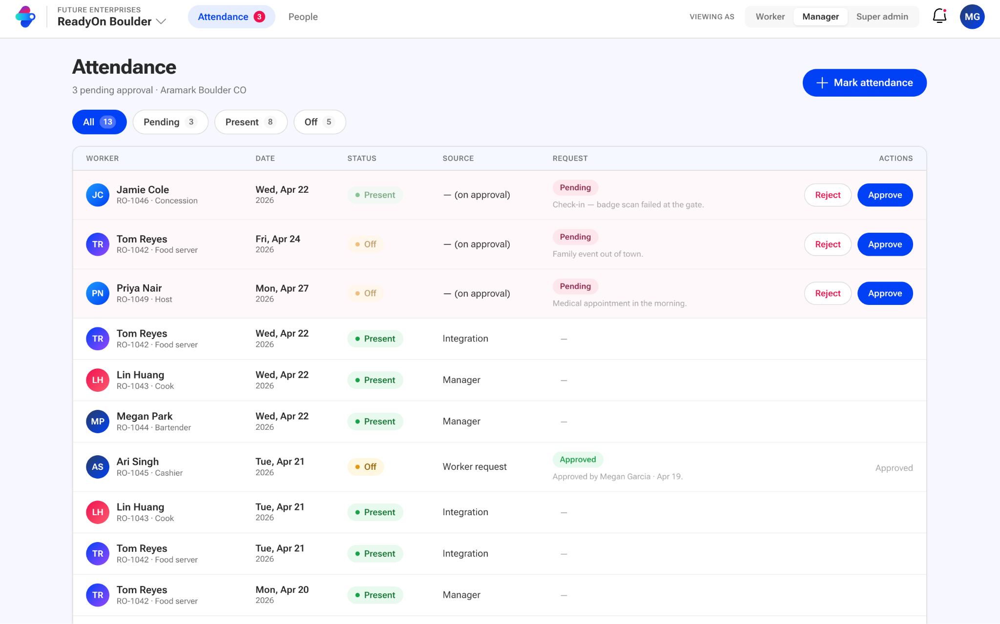
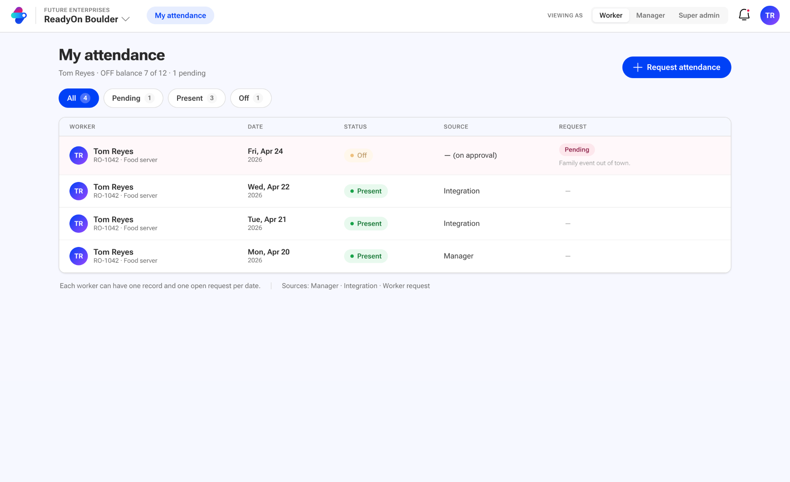
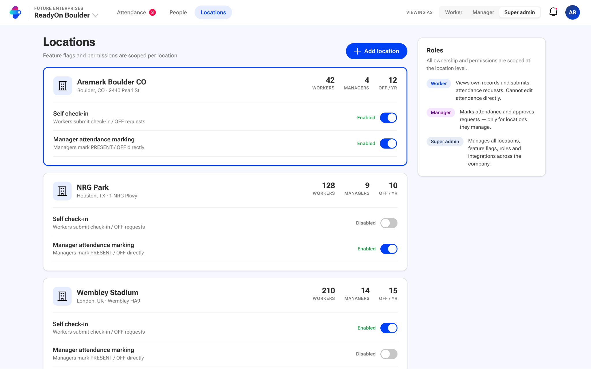

# Workforce Management System — Interview Requirements

Source: the published interview document ([Google Docs](https://docs.google.com/document/d/e/2PACX-1vSPmiawTCigg9SZ7UqRuPz0T-WYHRBkhW3C53oIke5cwylyA4KlLRBK_WC2dhnRXpnWVZAFYetlgr2w/pub)), reproduced here verbatim with its mock-ups so the repo is self-contained. See `README.md` for how this implementation answers each point, `CONTEXT.md` for the glossary, and `docs/adr/` for the decisions.

**Format:** AI-assisted live coding
**Duration:** 60 minutes

Build a workforce management system consisting of:

- A GraphQL gateway
- A React + TypeScript frontend

The frontend should communicate only with the GraphQL gateway.

You may use any language, framework, libraries, or AI tools.

## Domain

### Company

- There is a single company in the system.
- The company operates across multiple locations.
- All permissions and ownership are scoped at the location level.

### Location

- A location contains workers and managers.
- A location has configurable feature flags:
  - Self check-in enabled
  - Manager attendance marking enabled
- These flags should influence system behaviour.

### Worker

- A worker belongs to one or more locations.
- A worker has:
  - A unique external identifier
  - A job title at each location

Constraints:

- Job titles must be unique within a location.

### Manager

- A manager belongs to one or more locations.
- Managers are responsible for operational workflows within their locations.

## Attendance

- Attendance is tracked per worker, per date, and per location.
- A worker's attendance for a day can be either:
  - PRESENT
  - OFF
- Attendance may originate from:
  - Manager marking attendance
  - Third-party integrations
  - Approved worker attendance requests

## Worker Attendance Requests

- Workers cannot directly modify attendance.
- Instead, workers submit attendance requests which must be approved by a manager before affecting attendance.
- A request may represent:
  - Check in / Check out (PRESENT)
  - OFF

Constraints:

- Only one attendance record may exist per worker per date.
- Only one attendance request may exist per worker per date.
- Attendance requests may be created for both past and future dates.
- Managers may only approve requests for locations they manage.
- Once approved, the request updates the attendance record.
- Third-party systems should be able to identify workers using their external identifier.

Request statuses:

- PENDING
- APPROVED
- REJECTED
- CANCELLED

Workers have an annual OFF-day balance.

## Roles

The system should support:

- WORKER
- MANAGER
- SUPER_ADMIN

Authorization should be enforced appropriately.
Authentication may be simulated.

## Persistence

A relational database is strongly preferred.
We recommend PostgreSQL and expect candidates to design schemas that align with the service boundaries they choose.

Be prepared to discuss:

- Database design
- Service ownership
- Relationships across services
- Data consistency
- Authorization

## Expectations

The exercise is intentionally open-ended.

Use your judgment to determine:

- Service boundaries
- Database schemas
- GraphQL schema
- Gateway or federation approach
- API design
- Authorization model
- Frontend structure
- Communication between services

Seed enough data to demonstrate the system.

## Deliverables

Provide a running solution demonstrating the core workflows.

Be prepared to discuss:

- Architectural decisions
- Tradeoffs made during implementation
- What you would build next

## Mock ups

The attached mock ups are just for reference for better visualization that means you can be creative and create your own UI as well.

### Manager view

### Worker view

### Super-admin view

